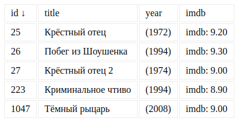

# Домашнее задание №3 к лекции «Работа с DOM»

[](https://ci.appveyor.com/project/yuriyvyatkin/ahj-hw-2-3-sorting-in-memory)

## In-Memory Sorting (задача со звёздочкой)

Важно: эта задача не является обязательной. Её (не)выполнение не влияет на получение зачёта по ДЗ.

#### Легенда

Достаточно намучившись с `data-*` вы поняли, что хранить всю информацию в DOM и в атрибутах в частности, не всегда самая лучшая идея и решили реализовать хранение в памяти.

#### Описание

Формат приходящих данных (JSON):
```json
[
  {
    "id": 26,
    "title": "Побег из Шоушенка",
    "imdb": 9.30,
    "year": 1994
  },
  {
    "id": 25,
    "title": "Крёстный отец",
    "imdb": 9.20,
    "year": 1972
  },
  {
    "id": 27,
    "title": "Крёстный отец 2",
    "imdb": 9.00,
    "year": 1974
  },
  {
    "id": 1047,
    "title": "Тёмный рыцарь",
    "imdb": 9.00,
    "year": 2008
  },
  {
    "id": 223,
    "title": "Криминальное чтиво",
    "imdb": 8.90,
    "year": 1994
  }
]
```

Храните все полученные объекты в памяти в виде массива и сортировку осуществляйте на базе этого массива (мутировать массив или нет - решать вам). После каждой сортировки пересобирайте заново дерево DOM.

Формат генерируемого DOM должен быть такой же, как в предыдущей задаче.

Внешний вид без сортировки (вы можете визуально улучшить отображение):


Обратите внимание, в каком виде выводятся оценки (после точки всегда два символа).

При сортировке по id (по возрастанию):



Обратите внимание на стрелку возле id.


Всё должно собираться через Webpack (включая картинки и стили) и выкладываться на Github Pages через CI.
